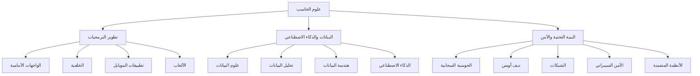

# 🚀 دليل شامل لتخصصات علوم الحاسب

🌍 **اللغات:** [English](README.md) | [العربية](README_ar.md)

مرحبًا بك في **المستودع الشامل لتعلم علوم الحاسب**!  
يهدف هذا المشروع إلى تقديم مسارات تعليمية منظمة وسهلة للمبتدئين في أهم مجالات علوم الحاسب وهندسة البرمجيات.

---

## 🧭 فهرس المحتويات
1. [🎯 أهداف المشروع](#-أهداف-المشروع)
2. [👩‍💻 لمن هذا الدليل؟](#-لمن-هذا-الدليل)
3. [📘 كيفية استخدام المستودع](#-كيفية-استخدام-المستودع)
4. [📚 المسارات التعليمية](#-المسارات-التعليمية)
5. [🤝 المساهمة](#-المساهمة)
6. [📄 الترخيص](#-الترخيص)

---

## 🎯 أهداف المشروع
- تقديم مسارات تعليمية واضحة ومنظمة لتخصصات علوم الحاسب المختلفة  
- مساعدة المبتدئين على فهم مجالات وفرص العمل في التقنية  
- توفير محتوى عملي وتمارين ومشاريع واقعية  
- دعم اللغتين **العربية والإنجليزية** لتسهيل التعلم للجميع  

---

## 👩‍💻 لمن هذا الدليل؟
هذا الدليل مناسب لـ:
- 🎓 الطلاب في تخصصات علوم الحاسب وما شابهها  
- 🔁 الراغبين في التحول المهني إلى مجال التقنية  
- 💼 المحترفين الذين يرغبون بتوسيع خبراتهم  
- 🧠 المتعلمين ذاتيًا الباحثين عن خطة منظمة  

---

## 📘 كيفية استخدام المستودع
1. اختر المسار التعليمي الذي يناسبك من القائمة أدناه.  
2. افتح المجلد المخصص له وابدأ من ملف `README.md`.  
3. اتبع الترتيب الموصى به والمتطلبات المسبقة.  
4. نفّذ التمارين والمشاريع التطبيقية.  
5. استخدم الموارد الموصى بها للتعمق في التعلم.  

---

## 📚 المسارات التعليمية

### 💻 [تطوير الواجهات الأمامية](software-engineer/frontend-development_ar.md)
**النظرة العامة:** إنشاء واجهات ويب تفاعلية باستخدام HTML وCSS وJavaScript.  
**المتطلبات:** معرفة أساسية بـ HTML وCSS وJavaScript.  
**ما ستتعلمه:** التفاعل مع DOM، التصميم المتجاوب، وأساسيات React/Vue/Angular.

---

### ⚙️ [تطوير الخلفية](software-engineer/backend-development_ar.md)
**النظرة العامة:** برمجة الخوادم وتصميم واجهات الـ API.  
**المتطلبات:** أساسيات البرمجة والشبكات.  
**ما ستتعلمه:** REST/GraphQL، قواعد البيانات، المصادقة، والنشر.

---

### 📱 [تطوير تطبيقات الموبايل](software-engineer/mobile-development_ar.md)
**النظرة العامة:** بناء تطبيقات أصلية وعبر الأنظمة.  
**المتطلبات:** خبرة سابقة بـ JavaScript أو Kotlin أو Swift أو Dart.  
**ما ستتعلمه:** دورة حياة التطبيق، واجهات المستخدم، وأدوات التطوير.

---

### 🎮 [تطوير الألعاب](software-engineer/game-development_ar.md)
**النظرة العامة:** تعلم تصميم الألعاب وبرمجتها.  
**المتطلبات:** أساسيات البرمجة والرياضيات.  
**ما ستتعلمه:** محركات الألعاب (Unity/Unreal)، التقديم الثلاثي الأبعاد، والرسومات.

---

### 🧱 [هندسة البيانات](./data-engineering/README_ar.md)
**النظرة العامة:** بناء أنظمة معالجة وتخزين البيانات.  
**المتطلبات:** SQL وPython.  
**ما ستتعلمه:** خطوط نقل البيانات (ETL)، أنظمة التخزين، ومعالجة البيانات الضخمة.

---

### 📊 [تحليل البيانات](./data-analysis/README_ar.md)
**النظرة العامة:** استخراج الرؤى من البيانات عبر التحليل والتصوير البياني.  
**المتطلبات:** إحصاء أساسي وجدول بيانات.  
**ما ستتعلمه:** تنظيف البيانات، التحليل الاستكشافي، والتصور باستخدام Python أو R.

---

### 🤖 [علوم البيانات](./data-science/README_ar.md)
**النظرة العامة:** تعلم الذكاء الاصطناعي ونماذج التعلم الآلي.  
**المتطلبات:** الإحصاء، الجبر الخطي، وPython.  
**ما ستتعلمه:** التعلم الخاضع/غير الخاضع للإشراف، التقييم، والتجارب.

---

### 🤖 [الذكاء الاصطناعي](./AI/README_ar.md)
**النظرة العامة:** الغوص في عالم الذكاء الاصطناعي وتخصصاته الأساسية.  
**المتطلبات:** رياضيات (جبر خطي، تفاضل وتكامل، إحصاء) وبرمجة بايثون.  
**ما ستتعلمه:** تعلم الآلة، التعلم العميق، معالجة اللغات الطبيعية، رؤية الحاسوب، هندسة تعلم الآلة، التعلم المعزز، وأمان الذكاء الاصطناعي.

---

### ☁️ [الحوسبة السحابية](./cloud-computing/README_ar.md)
**النظرة العامة:** فهم المنصات السحابية والأنظمة الموزعة.  
**المتطلبات:** أساسيات لينكس والشبكات.  
**ما ستتعلمه:** IaaS/PaaS، السيرفرليس، وأنماط التصميم للسعة العالية.

---

### 🔧 [هندسة DevOps](./devops-engineering/README_ar.md)
**النظرة العامة:** أتمتة النشر والبنية التحتية.  
**المتطلبات:** Git والبرمجة النصية.  
**ما ستتعلمه:** خطوط CI/CD، الحاويات، والأتمتة والمراقبة.

---

### 🌐 [الشبكات](./networking/README_ar.md)
**النظرة العامة:** دراسة أساسيات الشبكات والبروتوكولات.  
**المتطلبات:** معرفة أساسية بالنظم.  
**ما ستتعلمه:** TCP/IP، التوجيه، التبديل، واستكشاف الأخطاء.

---

### 🛡️ [الأمن السيبراني](./cybersecurity/README_ar.md)
**النظرة العامة:** حماية الأنظمة من التهديدات والهجمات.  
**المتطلبات:** أساسيات النظم والشبكات.  
**ما ستتعلمه:** تحليل المخاطر، الثغرات، والتصميم الآمن.

---

### 🔌 [الأنظمة المضمنة](./embedded-systems/README_ar.md)
**النظرة العامة:** البرمجة منخفضة المستوى والتعامل مع العتاد.  
**المتطلبات:** C/C++ وهندسة الحاسب.  
**ما ستتعلمه:** أنظمة الوقت الحقيقي RTOS، برمجة الحساسات، وتحسين الأداء.

---

## 🤝 المساهمة
نرحب بمساهماتك!  
يمكنك:
- 🐛 الإبلاغ عن أخطاء أو اقتراحات  
- 🔧 إرسال طلبات تحسين (Pull Requests)  
- 🌍 المساعدة في الترجمة  
- 💬 مشاركة خبراتك  

---

## 📄 الترخيص
هذا المشروع مفتوح المصدر ومتاح تحت ترخيص **MIT**.
