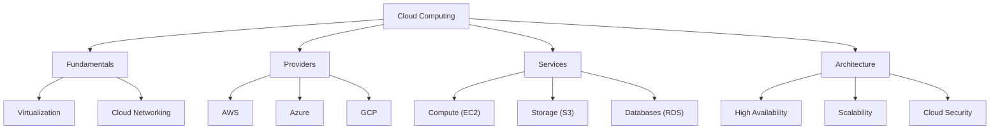

# ☁️ Cloud Computing

> **Languages:** [English](README.md) | [العربية](README_ar.md)

Welcome to the **Cloud Computing** track! Master the delivery of computing services—including servers, storage, databases, networking, software, analytics, and intelligence—over the Internet.

## 🗺️ Roadmap

## 📚 Core Content

- **[Cloud Computing Guide (English)](cloud-computing.md)**
- **[دليل الحوسبة السحابية (العربية)](cloud-computing_ar.md)**

## 🛠️ Projects

- **Host a Static Website**: Use AWS S3 or Azure Blob Storage to host a website.
- **Serverless API**: Build an API using AWS Lambda and API Gateway.
- **Load Balancer**: Set up a load balancer to distribute traffic across multiple instances.

---

[⬅️ Back to Main Roadmap](../README.md)
