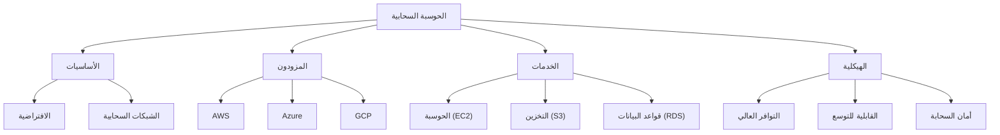

# ☁️ الحوسبة السحابية

> **اللغات:** [English](README.md) | [العربية](README_ar.md)

مرحبًا بك في مسار **الحوسبة السحابية**! أتقن تقديم خدمات الحوسبة — بما في ذلك الخوادم، التخزين، قواعد البيانات، الشبكات، البرمجيات، التحليلات، والذكاء — عبر الإنترنت.

## 🗺️ خارطة الطريق

## 📚 المحتوى الأساسي

- **[Cloud Computing Guide (English)](cloud-computing.md)**
- **[دليل الحوسبة السحابية (العربية)](cloud-computing_ar.md)**

## 🛠️ مشاريع

- **استضافة موقع ثابت**: استخدم AWS S3 أو Azure Blob Storage لاستضافة موقع ويب.
- **API بدون خادم (Serverless)**: ابني API باستخدام AWS Lambda و API Gateway.
- **موازن الحمل (Load Balancer)**: قم بإعداد موازن حمل لتوزيع حركة المرور عبر عدة خوادم.

---

[⬅️ العودة إلى الخارطة الرئيسية](../README_ar.md)
