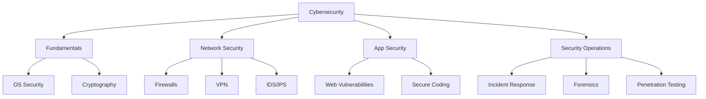

# 🛡️ Cybersecurity

> **Languages:** [English](README.md) | [العربية](README_ar.md)

Welcome to the **Cybersecurity** track! Learn how to protect systems, networks, and programs from digital attacks.

## 🗺️ Roadmap

## 📚 Core Content

- **[Cybersecurity Guide (English)](cybersecurity.md)**
- **[دليل الأمن السيبراني (العربية)](cybersecurity_ar.md)**

## 🛠️ Projects

- **Keylogger**: Build a simple keylogger (for educational purposes) to understand how it works.
- **Packet Sniffer**: Create a tool to capture and analyze network traffic.
- **Vulnerability Scanner**: Write a script to scan a network for open ports and vulnerabilities.

---

[⬅️ Back to Main Roadmap](../README.md)
