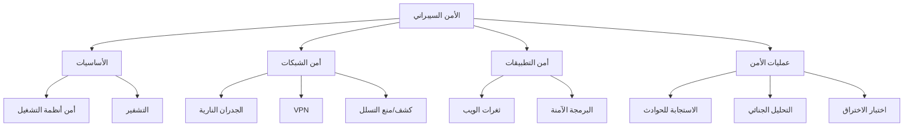

# 🛡️ الأمن السيبراني

> **اللغات:** [English](README.md) | [العربية](README_ar.md)

مرحبًا بك في مسار **الأمن السيبراني**! تعلم كيفية حماية الأنظمة والشبكات والبرامج من الهجمات الرقمية.

## 🗺️ خارطة الطريق

## 📚 المحتوى الأساسي

- **[Cybersecurity Guide (English)](cybersecurity.md)**
- **[دليل الأمن السيبراني (العربية)](cybersecurity_ar.md)**

## 🛠️ مشاريع

- **Keylogger**: بناء keylogger بسيط (لأغراض تعليمية) لفهم كيفية عمله.
- **Packet Sniffer**: إنشاء أداة لالتقاط وتحليل حركة مرور الشبكة.
- **Vulnerability Scanner**: كتابة سكربت لفحص الشبكة بحثًا عن منافذ مفتوحة وثغرات.

---

[⬅️ العودة إلى الخارطة الرئيسية](../README_ar.md)
