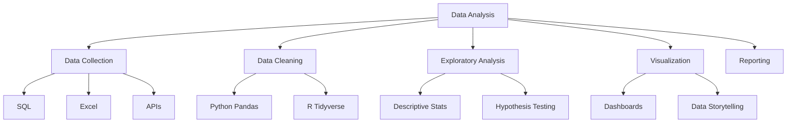

# 📊 Data Analysis

Welcome to the **Data Analysis** track! Focus on inspecting, cleansing, transforming, and modeling data to discover useful information.

## 🗺️ Roadmap

## 📚 Core Content

- **[Data Analysis Guide (English)](data-analysis.md)**
- **[دليل تحليل البيانات (العربية)](data-analysis_ar.md)**

## 🛠️ Projects

- **Sales Dashboard**: Create an interactive dashboard for sales data.
- **Web Scraper**: Scrape data from a website and analyze it.
- **Survey Analysis**: Analyze and visualize results from a survey.

---

[⬅️ Back to Main Roadmap](../README.md)
