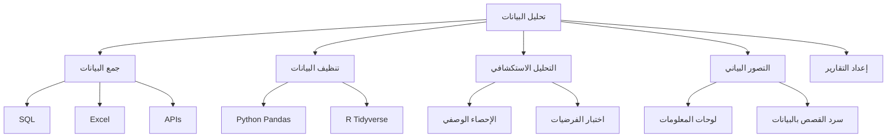

# 📊 تحليل البيانات

> **اللغات:** [English](README.md) | [العربية](README_ar.md)

مرحبًا بك في مسار **تحليل البيانات**! ركز على فحص وتنظيف وتحويل ونمذجة البيانات لاكتشاف معلومات مفيدة.

## 🗺️ خارطة الطريق

## 📚 المحتوى الأساسي

- **[Data Analysis Guide (English)](data-analysis.md)**
- **[دليل تحليل البيانات (العربية)](data-analysis_ar.md)**

## 🛠️ مشاريع

- **لوحة مبيعات**: إنشاء لوحة معلومات تفاعلية لبيانات المبيعات.
- **Web Scraper**: استخراج البيانات من موقع ويب وتحليلها.
- **تحليل استبيان**: تحليل وتصور نتائج استبيان.

---

[⬅️ العودة إلى الخارطة الرئيسية](../README_ar.md)
