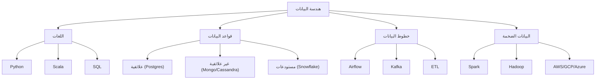

# 🧱 هندسة البيانات

> **اللغات:** [English](README.md) | [العربية](README_ar.md)

مرحبًا بك في مسار **هندسة البيانات**! تعلم تصميم وبناء أنظمة لجمع وتخزين وتحليل البيانات على نطاق واسع.

## 🗺️ خارطة الطريق

## 📚 المحتوى الأساسي

- **[Data Engineering Guide (English)](data-engineering.md)**
- **[دليل هندسة البيانات (العربية)](data-engineering_ar.md)**

## 🛠️ مشاريع

- **خط ETL**: بناء خط لاستخراج البيانات من API، تحويلها، وتحميلها في قاعدة بيانات.
- **مستودع بيانات**: تصميم مخطط وملء مستودع بيانات.
- **بث مباشر (Real-time Streaming)**: معالجة تدفق بيانات باستخدام Kafka و Spark.

---

[⬅️ العودة إلى الخارطة الرئيسية](../README_ar.md)
