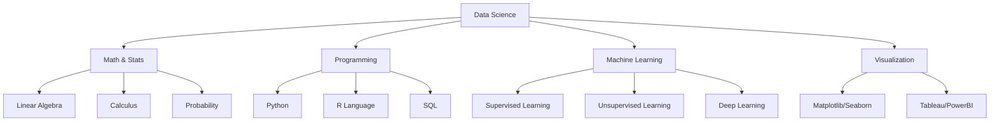

# 🤖 Data Science

> **Languages:** [English](README.md) | [العربية](README_ar.md)

Welcome to the **Data Science** track! Learn how to extract meaning from data using scientific methods, algorithms, and systems.

## 🗺️ Roadmap

## 📚 Core Content

- **[Data Science Guide (English)](data-science.md)**
- **[دليل علوم البيانات (العربية)](data-science_ar.md)**

## 🛠️ Projects

- **Predictive Modeling**: Build a model to predict housing prices.
- **Customer Segmentation**: Cluster customers based on purchasing behavior.
- **Sentiment Analysis**: Analyze social media text to determine sentiment.

---

[⬅️ Back to Main Roadmap](../README.md)
