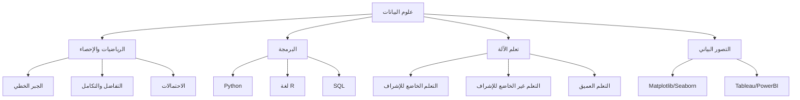

# 🤖 علوم البيانات

> **اللغات:** [English](README.md) | [العربية](README_ar.md)

مرحبًا بك في مسار **علوم البيانات**! تعلم كيفية استخراج المعاني من البيانات باستخدام الأساليب العلمية والخوارزميات والأنظمة.

## 🗺️ خارطة الطريق

## 📚 المحتوى الأساسي

- **[Data Science Guide (English)](data-science.md)**
- **[دليل علوم البيانات (العربية)](data-science_ar.md)**

## 🛠️ مشاريع

- **النمذجة التنبؤية**: بناء نموذج لتوقع أسعار المنازل.
- **تقسيم العملاء**: تجميع العملاء بناءً على سلوك الشراء.
- **تحليل المشاعر**: تحليل نصوص وسائل التواصل الاجتماعي لتحديد المشاعر.

---

[⬅️ العودة إلى الخارطة الرئيسية](../README_ar.md)
