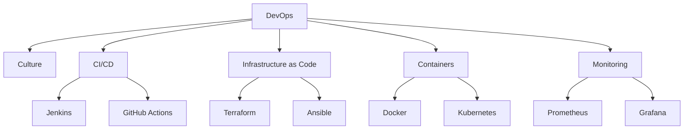

# 🔧 DevOps Engineering

Welcome to the **DevOps Engineering** track! Bridge the gap between development and operations to automate and improve the software delivery process.

## 🗺️ Roadmap

## 📚 Core Content

- **[DevOps Engineering Guide (English)](devops-engineering.md)**
- **[دليل هندسة DevOps (العربية)](devops-engineering_ar.md)**

## 🛠️ Projects

- **CI/CD Pipeline**: Set up a pipeline to automatically build and test your code on every commit.
- **Dockerize an App**: Containerize a web application and run it with Docker Compose.
- **Infrastructure as Code**: Provision a server on AWS using Terraform.

---

[⬅️ Back to Main Roadmap](../README.md)
