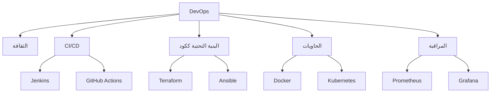

# 🔧 هندسة DevOps

> **اللغات:** [English](README.md) | [العربية](README_ar.md)

مرحبًا بك في مسار **هندسة DevOps**! سد الفجوة بين التطوير والعمليات لأتمتة وتحسين عملية تسليم البرمجيات.

## 🗺️ خارطة الطريق

## 📚 المحتوى الأساسي

- **[DevOps Engineering Guide (English)](devops-engineering.md)**
- **[دليل هندسة DevOps (العربية)](devops-engineering_ar.md)**

## 🛠️ مشاريع

- **خط CI/CD**: إعداد خط لبناء واختبار الكود تلقائيًا عند كل تحديث.
- **تطبيق في حاوية (Dockerize)**: وضع تطبيق ويب في حاوية وتشغيله باستخدام Docker Compose.
- **البنية التحتية ككود**: إنشاء خادم على AWS باستخدام Terraform.

---

[⬅️ العودة إلى الخارطة الرئيسية](../README_ar.md)
