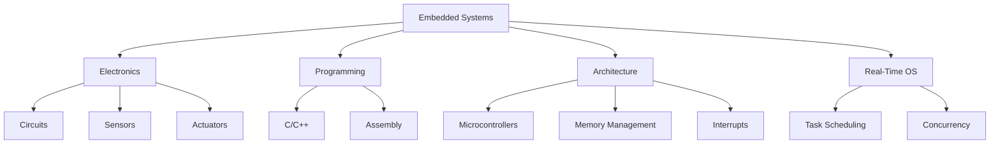

# 🔌 Embedded Systems

> **Languages:** [English](README.md) | [العربية](README_ar.md)

Welcome to the **Embedded Systems** track! Learn to design and program computing systems that are embedded in everyday devices.

## 🗺️ Roadmap

## 📚 Core Content

- **[Embedded Systems Guide (English)](os-and-embedded-systems.md)**
- **[دليل الأنظمة المضمنة (العربية)](os-and-embedded-systems_ar.md)**

## 🛠️ Projects

- **Blink an LED**: The "Hello World" of embedded systems using an Arduino or STM32.
- **Temperature Sensor**: Read data from a sensor and display it on an LCD.
- **Smart Home Controller**: Control lights or appliances using a microcontroller and a relay.

---

[⬅️ Back to Main Roadmap](../README.md)
