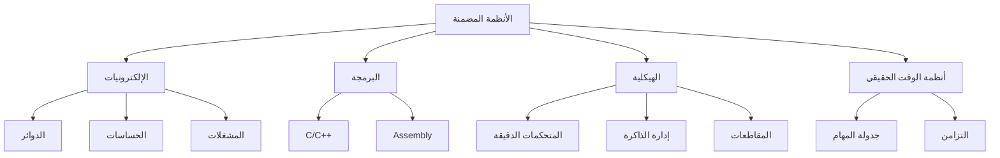

# 🔌 الأنظمة المضمنة

> **اللغات:** [English](README.md) | [العربية](README_ar.md)

مرحبًا بك في مسار **الأنظمة المضمنة**! تعلم تصميم وبرمجة الأنظمة الحاسوبية المدمجة في الأجهزة اليومية.

## 🗺️ خارطة الطريق

## 📚 المحتوى الأساسي

- **[Embedded Systems Guide (English)](os-and-embedded-systems.md)**
- **[دليل الأنظمة المضمنة (العربية)](os-and-embedded-systems_ar.md)**

## 🛠️ مشاريع

- **وميض LED**: مشروع "Hello World" للأنظمة المضمنة باستخدام Arduino أو STM32.
- **حساس درجة الحرارة**: قراءة البيانات من حساس وعرضها على شاشة LCD.
- **تحكم المنزل الذكي**: التحكم في الأضواء أو الأجهزة باستخدام متحكم دقيق ومرحل (Relay).

---

[⬅️ العودة إلى الخارطة الرئيسية](../README_ar.md)
