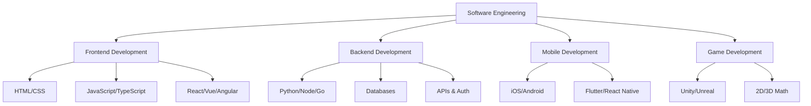

# 💻 Software Engineering

> **Languages:** [English](README.md) | [العربية](README_ar.md)

Welcome to the **Software Engineering** hub! This directory covers the core pillars of application development.

## 🗺️ Roadmap

## 📚 Tracks

### 🎨 [Frontend Development](frontend-development.md)
Build beautiful, interactive user interfaces for the web.
- **Key Tech**: HTML, CSS, JavaScript, React, Vue.

### ⚙️ [Backend Development](backend-development.md)
Power the web with robust server-side logic and databases.
- **Key Tech**: Node.js, Python, SQL, APIs.

### 📱 [Mobile Development](mobile-development.md)
Create apps for iOS and Android devices.
- **Key Tech**: Swift, Kotlin, Flutter, React Native.

### 🎮 [Game Development](game-development.md)
Design and build immersive video games.
- **Key Tech**: Unity, C#, Unreal Engine, C++.

---

[⬅️ Back to Main Roadmap](../README.md)
