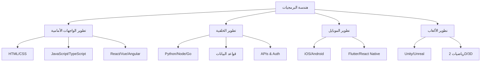

# 💻 هندسة البرمجيات

> **اللغات:** [English](README.md) | [العربية](README_ar.md)

مرحبًا بك في مركز **هندسة البرمجيات**! يغطي هذا الدليل الركائز الأساسية لتطوير التطبيقات.

## 🗺️ خارطة الطريق

## 📚 المسارات

### 🎨 [تطوير الواجهات الأمامية](frontend-development_ar.md)
بناء واجهات مستخدم تفاعلية وجميلة للويب.
- **التقنيات الرئيسية**: HTML, CSS, JavaScript, React, Vue.

### ⚙️ [تطوير الخلفية](backend-development_ar.md)
تشغيل الويب بمنطق خادم قوي وقواعد بيانات.
- **التقنيات الرئيسية**: Node.js, Python, SQL, APIs.

### 📱 [تطوير تطبيقات الموبايل](mobile-development_ar.md)
إنشاء تطبيقات لأجهزة iOS و Android.
- **التقنيات الرئيسية**: Swift, Kotlin, Flutter, React Native.

### 🎮 [تطوير الألعاب](game-development_ar.md)
تصميم وبناء ألعاب فيديو غامرة.
- **التقنيات الرئيسية**: Unity, C#, Unreal Engine, C++.

---

[⬅️ العودة إلى الخارطة الرئيسية](../README_ar.md)
